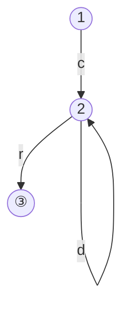
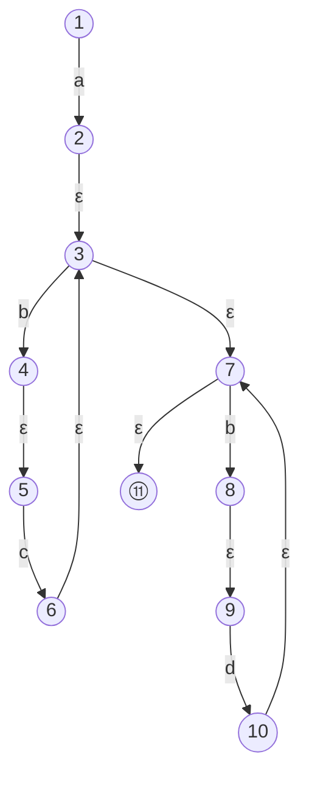
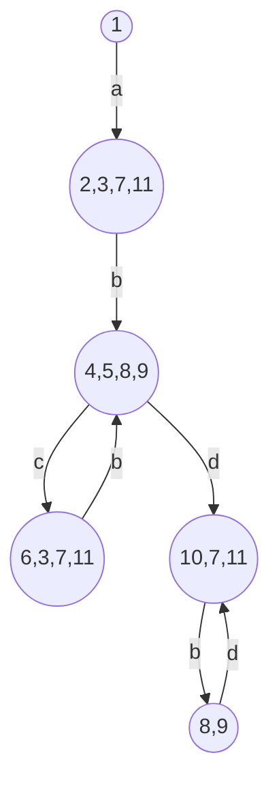
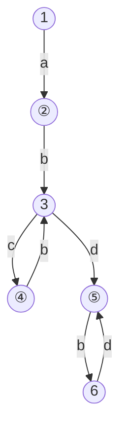

# 2章 字句解析 演習問題

## 2.1 文字列集合 c・{a,d}*・r を求めよ。

A. {cr, car, cdr, caar, cadr, cdar, ...}

> さりげなくLispのコンスセルを出してくるお茶目な著者

## 2.2 前問の集合を現す正規表現を求めよ。

A. c(a|d)*r

## 2.3 有限オートマトン <Σ, {1,2,3}, {<1,c,2>,<2,a,2>,<2,d,2>,<2,r,3>},1,{3}>の状態遷移図をかけ。

## 2.4 アルゴリズム2.3に従ってアルファベット{a,b,c,d}上の正規表現a(bc)\*(bd)\*と等価なNFAを求めよ。

連結はε遷移で連結する

閉包はε遷移で始点まで戻し、ε遷移で始点から抜ける

## 2.5 アルゴリズム2.4に従って、全問で求めたNFAと等価なDFAを求めよ。

- 始点からεで到達可能な状態は始点だけ、 $T(s) = \{1\}$
- そこからaとεで3へ到達可能、かつaεεで7へ到達可能、かつaεεεで11へ到達可能なので2,3,7,11を一つの状態にまとめる
- 2,3,7,11からbとεで4と5、8と9へ到達可能なので一つの状態にまとめる
- 4,5,8,9からcとεで到達可能な6,3,7,11を一つの状態にまとめる
- 4,5,8,9からdとεで到達可能な10,7,11を一つの状態にまとめる
- 10,7,11からbとεで到達可能な10,7,11へループする
- 11を含む2,3,7,11/6,3,7,11/10,7,11が終了状態になる

## 2.6 アルゴリズム2.5に従って、全問で求めたDFAを、状態数最小のDFAに変換せよ。

まず状態を1,3,6と2,4,5のグループに分ける

3と6は文字cについて $\delta(3,c) \neq \perp, \delta(6,c) = \perp $なので別グループ。aについてみれば同様に1も別グループ。

2,4,5について、いずれも $\delta(\_,b) \neq \perp$だが、2と4は行き先が同じグループに属するので同じグループになる。結果的に2と4だけは集約できる

## 2.7 例2.12の言語に対して、入力がiff if のときに字句要素の切り出しをする関数scanの動作をトレースせよ。

- ifまでadvance_cを続けて読み込んだ時点で受理状態になるので、mark_buf関数を実行してtoの値をmarkに保存する
- ただし、次の文字fによる状態遷移が存在するのでさらにadvance_cを行う
- 再び受理状態になるのでtoの値をmarkに保存
- 空白による遷移は存在せず、qfが定義されているのでcutout_lexeme関数を実行して受理状態qfのマーカ(識別子に対応する2)を返す

## 2.8 2.7節の方法に従って、問2.3の有限オートマトンを正規表現に変換せよ。

