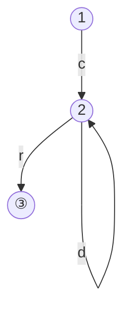

# 2章 字句解析 演習問題

## 2.1 文字列集合 $\{c\}\cdot \{a, d\}^* \cdot \{r\}$を求めよ。

A. {cr, car, cdr, caar, cadr, cdar, ...}

> さりげなくLispのコンスセルを出してくるお茶目な著者

## 2.2 前問の集合を現す正規表現を求めよ。

A. c(a|d)*r

## 2.3 有限オートマトン <Σ, {1,2,3}, {<1,c,2>,<2,a,2>,<2,d,2>,<2,r,3>},1,{3}>の状態遷移図をかけ。

## 2.4 アルゴリズム2.3に従ってアルファベット{a,b,c,d}上の正規表現a(bc)\*(bd)\*と等価なNFAを求めよ。

連結はε遷移で連結する

閉包はε遷移で始点まで戻し、ε遷移で始点から抜ける

## 2.5
アルゴリズム2.4に従って、全問で求めたNFAと等価なDFAを求めよ。

## 2.6 アルゴリズム2.5に従って、全問で求めたDFAを、状態数最小のDFAに変換せよ。

## 2.7 例2.12の言語に対して、入力がiff if のときに字句要素の切り出しをする巻数scanの動作をトレースせよ。

## 2.8 2.7節の方法に従って、問2.3の有限オートマトンを正規表現に変換せよ。

