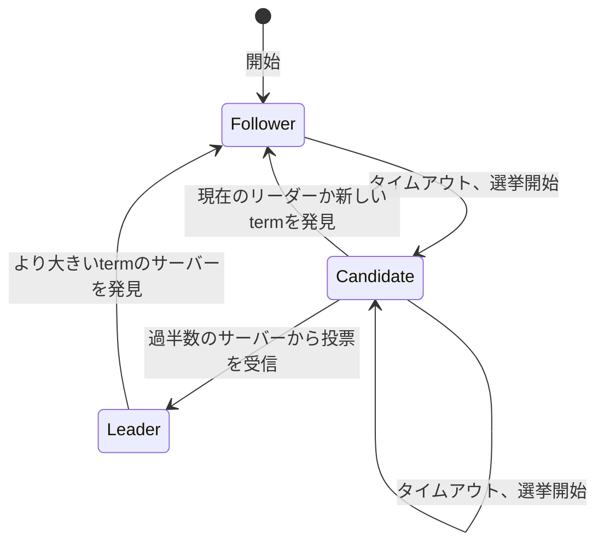

# Raft原論文 (In Search of an Understandable Consensus Algorithm)

*In Search of an Understandable Consensus Algorithm* を読んで要点をまとめる

1:イントロ 2:複製状態機械の導入 3:Paxosの長短を論じる 4:理解しやすさのためのアプローチ 5-8:Raftの説明 9:Raftの評価 10:関連研究

## 1 Introduction

合意アルゴリズムは、いくつかのメンバーが障害を起こしてもグループとしての一貫性を保つ状態機械の集合を実現する

この分野ではPaxosが支配的で多くの実装がそれをベースにしていたが、実用的なシステムで用いるにはPaxosは複雑すぎるし学習も難しい

その代わりとして、理解のしやすさを最重要視したRaftアルゴリズムを考案した。理解しやすくするためにとったアプローチは大きく2つ

- 動作をいくつかの種別に分割して別の問題として取り扱う
  - リーダー選出
  - ログ複製
  - 安全性
- 状態空間を減らす

## 2 Replicated state machines

合意アルゴリズムが重要な意味を持つのは複製状態機械という文脈において。

複製状態機械は、一部のノードが障害で落ちても論理的には単一の機械として動作を続けるシステムを実現するためのアイディア。同一順序の命令列コピーを決定的な状態機械の間で複製すれば、命令を適用した結果の状態は全ての状態機械の間で等しくなるというもの。

では同一順序の命令列コピーを一貫性を保って共有するためにはどうすればよいのか？それを実現するためのアルゴリズムが合意アルゴリズムというわけ。

合意アルゴリズムに求められる要件は

1. (安全性) ネットワーク遅延/分断・パケット損失/重複/反転などの非ビザンチン障害下でも安全であること=誤った結果を返さないこと
2. (可用性) 過半数のサーバーが他のサーバーやクライアントと通信できる正常状態にある限り、システム全体が機能すること
3. (一貫性) 任意のタイミングでログの一貫性が保証されること=最悪でも可用性が損なわれるだけにとどまること
4. (パフォーマンス) 過半数のサーバーが1往復のRPCに返答した時点で命令が完了すること=遅い一部のサーバーがパフォーマンスに悪影響を及ぼさないこと

## 3 What's wrong with Paxos?

1. Paxosは難しすぎる。著者らも単純化されたsingle Paxosの説明をいくつか読んだ後に似たようなアルゴリズムを自分で実装して初めて理解できたし、それすら1年近くかかった
2. Paxosは実用的な実装を行うためのベースとして不適。single Paxosは単一の値しか取り扱わないので論外だし、multi-PaxosについてもLamport自身は不完全なスケッチしか提供しておらず、Paxosを最適化するいくつかの提案はそれぞれ別物。リーダーの概念がなくpeer-to-peerなのも実世界では非効率。Paxosベースで実装しようとした結果、実世界の問題に対処するための変更を加えていった結果最終的には全く異なるアーキテクチャになり、時間は浪費するしエラーの温床になる。理論と実装の乖離

以上から、教育的にも実用的にもPaxosは良い基盤にはならない。

> Paxosのことボロクソに言ってるの面白い

## 4 Designing for understandability

Paxosの問題点を踏まえて、システムを構築するための実用的な基礎となる合意アルゴリズムには理解可能性(understandability)が最重要。

そのために以下のアプローチをとる

- 問題の分解。可能なときには必ず問題を分割して、それぞれの問題を独立に理解できるようにする
  - リーダー選出
  - ログ複製
  - 安全性
  - メンバー変更
- 考慮すべき状態の組み合わせ数を減らし、非決定性を可能な限り取り除く。
  - ログに穴が空いた状態を許さず、またログがサーバー間で一貫していない状態が生じにくいような設計にした
  - ときには非決定性が問題を単純化する場合もある。特にリーダー選出アルゴリズムには乱数を用いることで多くのケースを同様に取り扱えるようにした.

## 5 The Raft consensus algorithm

Raftの基本的な構成は、はじめにリーダーを選出し、そのリーダーが複製ログの管理を一手に担うというもの。リーダーはクライアントからログエントリを受け取り、他のサーバーに複製し、ログエントリを状態機械に適用する安全なタイミングを伝達する。リーダーが障害を起こしたりネットワークから切り離されたりしたら、新しいリーダーが選出される

以下の性質を満たす。

1. Election Safety: 任意のtermにおいて高々1つしかリーダーが選出されない。
2. Leader Append-Only: リーダーはログの変更を行わず、追加のみ行う。
3. Log Matching: 2つのログが同じインデックスとtermを持つログエントリを含むならば、それ以前のインデックスのログエントリが全て等しい。
4. Leader Completeness: ログエントリがあるtermでコミットされたならば、それ以降のtermで選出されたリーダーのログには必ずそのログエントリが含まれる。
5. State Machine Safety: あるサーバーがあるインデックスのログエントリを状態機械に適用したならば、他のサーバーがそのインデックスにおいて異なるログエントリを状態機械に適用することはない。

### 5.1 Raft basics

Raftクラスタは奇数のサーバーからなり、それぞれのサーバーがリーダー・フォロワー・候補者のいずれかの状態を持っている。

通常はただ1つのサーバーがリーダーでその他のサーバーはフォロワーとなる。フォロワーは受動的で、自分からはリクエストを行わずリーダーと候補者への返答に徹する。クライアントからのリクエストは全てリーダーが処理し、フォロワーはリクエストをリーダーにリダイレクトする。

時間幅をtermという単位で区切り、term1つごとに高々1つのリーダーを選出する。termは必ず選挙(リーダー選出手続き)から始まり、選出されたサーバーはtermの間リーダーとして振る舞う。選挙が票の分割などで成功しなかった場合はtermはすぐに終わり、次のtermが開始する。

