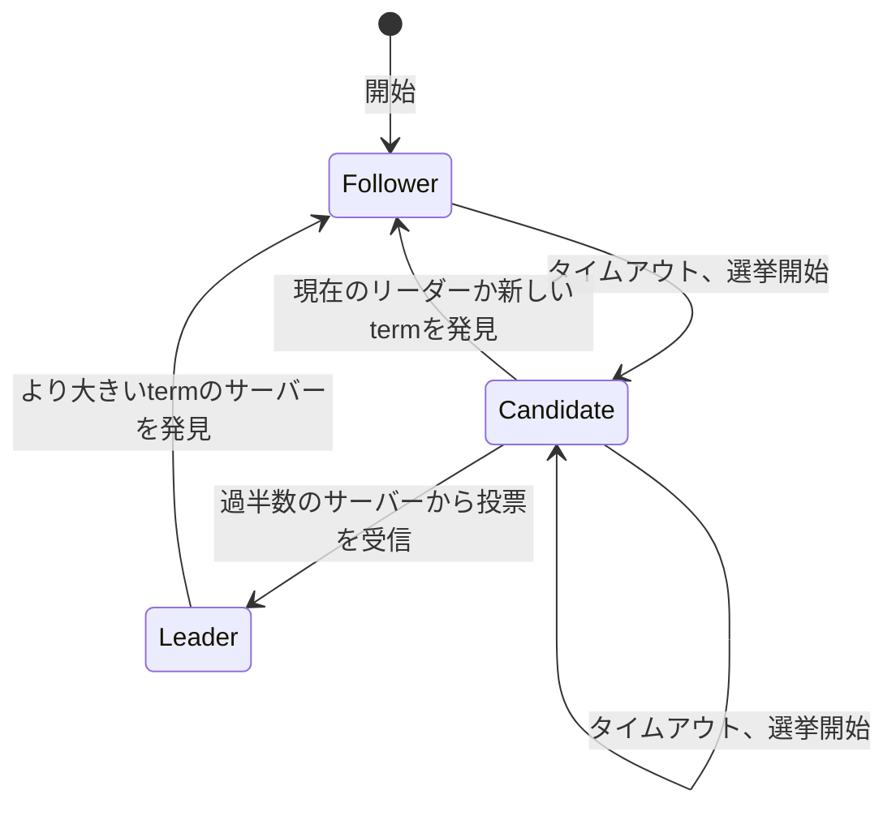

# Raft原論文 (In Search of an Understandable Consensus Algorithm)

*In Search of an Understandable Consensus Algorithm* を読んで要点をまとめる

1:イントロ 2:複製状態機械の導入 3:Paxosの長短を論じる 4:理解しやすさのためのアプローチ 5-8:Raftの説明 9:Raftの評価 10:関連研究

## 1 Introduction

合意アルゴリズムは、いくつかのメンバーが障害を起こしてもグループとしての一貫性を保つ状態機械の集合を実現する

この分野ではPaxosが支配的で多くの実装がそれをベースにしていたが、実用的なシステムで用いるにはPaxosは複雑すぎるし学習も難しい

その代わりとして、理解のしやすさを最重要視したRaftアルゴリズムを考案した。理解しやすくするためにとったアプローチは大きく2つ

- 動作をいくつかの種別に分割して別の問題として取り扱う
  - リーダー選出
  - ログ複製
  - 安全性
- 状態空間を減らす

## 2 Replicated state machines

合意アルゴリズムが重要な意味を持つのは複製状態機械という文脈において。

複製状態機械は、一部のノードが障害で落ちても論理的には単一の機械として動作を続けるシステムを実現するためのアイディア。同一順序の命令列コピーを決定的な状態機械の間で複製すれば、命令を適用した結果の状態は全ての状態機械の間で等しくなるというもの。

では同一順序の命令列コピーを一貫性を保って共有するためにはどうすればよいのか？それを実現するためのアルゴリズムが合意アルゴリズムというわけ。

合意アルゴリズムに求められる要件は

1. (安全性) ネットワーク遅延/分断・パケット損失/重複/反転などの非ビザンチン障害下でも安全であること=誤った結果を返さないこと
2. (可用性) 過半数のサーバーが他のサーバーやクライアントと通信できる正常状態にある限り、システム全体が機能すること
3. (一貫性) 任意のタイミングでログの一貫性が保証されること=最悪でも可用性が損なわれるだけにとどまること
4. (パフォーマンス) 過半数のサーバーが1往復のRPCに返答した時点で命令が完了すること=遅い一部のサーバーがパフォーマンスに悪影響を及ぼさないこと

## 3 What's wrong with Paxos?

1. Paxosは難しすぎる。著者らも単純化されたsingle Paxosの説明をいくつか読んだ後に似たようなアルゴリズムを自分で実装して初めて理解できたし、それすら1年近くかかった
2. Paxosは実用的な実装を行うためのベースとして不適。single Paxosは単一の値しか取り扱わないので論外だし、multi-PaxosについてもLamport自身は不完全なスケッチしか提供しておらず、Paxosを最適化するいくつかの提案はそれぞれ別物。リーダーの概念がなくpeer-to-peerなのも実世界では非効率。Paxosベースで実装しようとした結果、実世界の問題に対処するための変更を加えていった結果最終的には全く異なるアーキテクチャになり、時間は浪費するしエラーの温床になる。理論と実装の乖離

以上から、教育的にも実用的にもPaxosは良い基盤にはならない。

> Paxosのことボロクソに言ってるの面白い

## 4 Designing for understandability

Paxosの問題点を踏まえて、システムを構築するための実用的な基礎となる合意アルゴリズムには理解可能性(understandability)が最重要。

そのために以下のアプローチをとる

- 問題の分解。可能なときには必ず問題を分割して、それぞれの問題を独立に理解できるようにする
  - リーダー選出
  - ログ複製
  - 安全性
  - メンバー変更
- 考慮すべき状態の組み合わせ数を減らし、非決定性を可能な限り取り除く。
  - ログに穴が空いた状態を許さず、またログがサーバー間で一貫していない状態が生じにくいような設計にした
  - ときには非決定性が問題を単純化する場合もある。特にリーダー選出アルゴリズムには乱数を用いることで多くのケースを同様に取り扱えるようにした.

## 5 The Raft consensus algorithm

Raftの基本的な構成は、はじめにリーダーを選出し、そのリーダーが複製ログの管理を一手に担うというもの。リーダーはクライアントからログエントリを受け取り、他のサーバーに複製し、ログエントリを状態機械に適用する安全なタイミングを伝達する。リーダーが障害を起こしたりネットワークから切り離されたりしたら、新しいリーダーが選出される

以下の性質を満たす。

1. Election Safety: 任意のtermにおいて高々1つしかリーダーが選出されない。
2. Leader Append-Only: リーダーはログの変更を行わず、追加のみ行う。
3. Log Matching: 2つのログが同じインデックスとtermを持つログエントリを含むならば、それ以前のインデックスのログエントリが全て等しい。
4. Leader Completeness: ログエントリがあるtermでコミットされたならば、それ以降のtermで選出されたリーダーのログには必ずそのログエントリが含まれる。
5. State Machine Safety: あるサーバーがあるインデックスのログエントリを状態機械に適用したならば、他のサーバーがそのインデックスにおいて異なるログエントリを状態機械に適用することはない。

### 5.1 Raft basics

Raftクラスタは奇数のサーバーからなり、それぞれのサーバーがリーダー・フォロワー・候補者のいずれかの状態を持っている。

通常はただ1つのサーバーがリーダーでその他のサーバーはフォロワーとなる。フォロワーは受動的で、自分からはリクエストを行わずリーダーと候補者への返答に徹する。クライアントからのリクエストは全てリーダーが処理し、フォロワーはリクエストをリーダーにリダイレクトする。

時間幅をtermという論理時刻で区切り、term1つごとに高々1つのリーダーを選出する。termは必ず選挙(リーダー選出手続き)から始まり、選出されたサーバーはtermの間リーダーとして振る舞う。選挙が票の分割などで成功しなかった場合はtermはすぐに終わり、次のtermが開始する。

サーバー間の通信では常にtermもやりとりし、自分が持っているtermよりも大きい値を見つけたらただちにその値に更新する。リーダーや候補者だった場合はフォロワーに降格する。自分よりも小さいtermのリクエストは全て拒否する。

termを用いることで古い情報を検出破棄できる

合意形成のためにサーバー間で行う通信は、基本的に2種類のRPCだけで良い

1. RequestVote
2. AppendEntries

### 5.2 Leader election

リーダーからは定期的にハートビート(エントリが空のAppendEntries)を送出してリーダーを維持する。フォロワーが選挙タイムアウト期間中に一度もハートビートを受け取らなかった場合、リーダー不在と判断して選挙を開始する。

#### 選挙の流れ

- フォロワーがtermを加算して候補者状態になる
- 自分自身に投票し、他のサーバーにRequestVote RPCを送信する
- 以下のいずれかが起こるまでこの状態を持続する
  - 選挙に勝つ
    - 過半数のサーバーからそのtermの投票を受け取る
    - リーダーになって他のサーバーにハートビートを送信する
  - 他のサーバーがリーダーになる
    - 他のサーバーから自身よりも大きいtermのAppendEntries RPCが送られてくる
  - 誰も選挙に勝たないまま一定期間が経過する
    - 票が分裂した場合に起こりうる。選挙タイムアウトが経過したところでtermを加算して再度選挙を開始する
    - 票が分裂するのを避けるため、選挙タイムアウトには乱数を用いて同じタイミングで複数の候補者が乱立するのを防止する。

#### RequestVote RPCを受け取ったサーバーの挙動

- 1termにつき高々1つまでの候補者にしか投票しない
- 最初に来たRequestVoteに投票する原則

> 元々は乱数を使わずサーバーに優先度を設定するアプローチを考えていたが、問題があった。問題を直すために修正を加えてもその度にコーナーケースが出現した。結局のところ乱数を用いたアプローチが明快で理解しやすかった。

### 5.3 Log replication

リーダーが選出された後はクライアントのリクエストを捌き始める。

クライアントのリクエストは複製状態機械への命令として表現される。リーダーはその命令と現在のtermの組をログのエントリとしてフォロワーへ送信する。これがAppendEntriesRPC。

エントリが問題なく過半数のサーバーに複製できた時点でそのエントリは「コミットされた」と判断する。この状態になったログエントリは永続化を保証できる。リーダーは状態機械にそのエントリを適用し、結果をクライアントに返却する。

リーダーはコミットされた最大のインデックスを保持しておき、AppendEntries RPCの度にフォロワーへ送信する。これによってフォロワーもどこまでコミットされたかを知ることができ、自身の状態機械をそのインデックスまで進めることができる。

> フォロワーもローカル状態機械を更新しておくことでリーダーが切り替わった際に迅速な交替が可能になる

このようなログ複製メカニズムによって以下2つの性質が保証される。この2つを合わせて Log Matching 性が保証される。

- 異なるサーバー上のログエントリが同じインデックスとtermを持つ場合、命令の内容も同じである。
- 異なるサーバー上のログエントリが同じインデックスとtermを持つ場合、それよりも前のログエントリは全て同一である。

1つ目の性質はリーダーがあるtermとインデックスについて高々1つのエントリしか作らず、またログエントリが移動することもないことから従う。

2つ目の性質は、AppendEntries RPCでチェックを行うことにより保証する。具体的には、RPC送信の際、複製しようとしているログの直前にあるログエントリのtermとインデックスを送信する。受信したフォロワーは同じtermとインデックスを持つログエントリがなければRPCを拒否する。ログが空のときには性質は満たされているので、そこから再帰的に保証されるというわけ。

リーダーが交代した場合、サーバー間でログが一貫していない状態が生じえる。その場合、リーダーのログを正としてフォロワーに上書きさせることによって一貫性を取り戻す。そのためにログが一致している最大のインデックスを探し、それ以降のフォロワーのログエントリを全て削除して複製し直す。

これを実現するため、リーダーは各サーバーに対するnextIndexという値を保持し、この値以降のログエントリをそのサーバーに対して複製する。最初はログの最後のエントリの次の値で始めるが、AppendEntries RPCが拒否された場合=ログが食い違った場合にnextIndexの値を小さくしていく。こうしていくといつかログが一致する時点が訪れるので、その時点でAppendEntries RPCは承認され、それ以降のログエントリが全て複製されたもので上書きされる。

上書きするのはフォロワーだけなので、リーダーは自分のログを上書きする必要も削除する必要もない。これが Leader Append-Only 性を保証する。

### 5.4 Safety

ここまでの説明では、まだ全ての状態機械が同じ命令列を同じ順序で適用することを保証できていない。例えばあるリーダーがログエントリをコミットしている間に障害を起こしていたフォロワーが後でリーダーに選出され、そのログエントリを複製で上書きしたとき、それらのサーバー間では状態機械が異なる状態になる。

Leader Completeness 性を保証するためには選挙にもう少し制限を加える必要がある。

#### 5.4.1 Election restriction

リーダーベースの合意アルゴリズムでは、リーダーはコミットされたログエントリを全て保持している必要がある。Viewstamped Replicationのようなアルゴリズムでは、足りないエントリがあればフォロワーからリーダーへ送信するという形でコミットされたログエントリの補完を実現する。

一方、Raftではそもそも**コミットされたログエントリを全て持っているサーバーしかリーダーに選ばれないようにする**ことでこれを実現する。RequestVote RPCに候補者のログに関する情報を含め、投票者はそのログが古いと判断した場合に投票を避ける。これによって過半数のサーバーが「ログが最新だ」と判断した場合にだけそのサーバーがリーダーに選出される。

ログの最新性は以下の基準で比較する。

- 最後のエントリのtermが異なる場合、termが大きいほうが新しいログである
- 最後のエントリのtermが同じ場合、ログが長いほうが新しいログである

#### 5.4.2 Committing entries from previous terms

過去のtermのログに関しては、過半数がそのエントリを持っていたからといってそれがコミットされているとは限らない(後で選出された少数派のリーダーに上書きされる可能性がある)。そのため、過去のtermのログがコミットされたかどうかの判断は直接行わない。

現在のtermについてだけ、過半数のフォロワーにログエントリが承認されたらコミットされたと判断する。過去のtermのログがコミットされたかどうかは現在のtermのログがコミットされたかどうか+Log Matching性から間接的に判断する

#### 5.4.3 Safety Argument

4. Leader Completeness: ログエントリがあるtermでコミットされたならば、それ以降のtermで選出されたリーダーのログには必ずそのログエントリが含まれる。

を証明する。

---

背理法を用いる。term T のリーダーがコミットしたログエントリEを、それより後に選出されるリーダーが持っていないと仮定して矛盾を導く。そのようなリーダーが出現する最小のtermをU(U > T)とする。

1. リーダーはエントリの削除も上書きも行わないので、リーダーUが選出された時点ですでにEを持っていなかったといえる。
2. リーダーTはクラスタの過半数にEを複製し、リーダーUはクラスタの過半数から投票を受けた。すなわち、少なくとも1つのサーバーはリーダーTからEを受け取り、かつリーダーUに投票したことになる。
3. リーダーTからEを受け取った後にリーダーUに投票したという時系列になるはず(逆ならtermの大小関係によりリーダーTからのAppendEntriesを拒否するはず)
4. 仮定から、TとUの間のリーダーは全てEを保持していたのでEが上書きされることはなく、リーダーUへ投票を行った時点でまだEを保持していたといえる。
5. リーダーUに投票を行ったということはすなわち、ログの最新性を認めたということである。ログの最新性比較には2つのパターンがあるので、それぞれについて矛盾を確認する。
  1. 投票者とリーダーUの最新ログエントリのtermが等しかった場合、リーダーUのログの方が投票者のログより長い、すなわち投票者が持っているログエントリと同一のものを全て含んでいたといえる。ここからEも含んでいることが結論され、これは仮定に反して矛盾。
  2. リーダーUの最新ログエントリのtermの方が大きかった場合、そのtermは少なくともTより大きい。リーダーUの最新ログエントリを作った過去のリーダーは、仮定よりEをログに含んでいたはずであり、Log Matching性よりリーダーUもEをログに含む。矛盾。
6. 以上の矛盾より、Tよりも大きい全てのtermについて、そのtermのリーダーはterm Tにコミットされた全てのログエントリを保持する。
7. Log Matching性より、将来的に選出されるリーダーも間接的にコミットされたエントリを保持することが保証される。◽️

---

